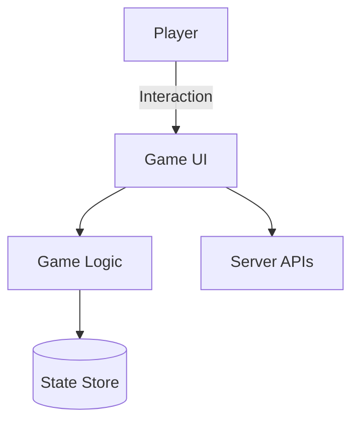

# Game Library

[](https://github.com/<org>/<repo>/actions)
[](LICENSE)

## Play classic games in your browser

Explore a collection of accessible web games. This project showcases a lightweight architecture and modern JavaScript tooling.

## Features

- Responsive design that works on any device
- Progressive web app support for offline play
- Clean separation between game logic and UI components
- Automated tests with [Vitest](https://vitest.dev)

## Architecture



## Installation

```bash
npm install
```

## Configuration

Set environment variables to customize behavior. See [docs/CONFIGURATION.md](docs/CONFIGURATION.md) for details.

## Usage

```bash
npm start
```

Open `http://localhost:3000` in a browser and enjoy.

## Branding & Theming

Reusable component styles live in [styles/components.css](styles/components.css) and draw colors and spacing from the global tokens. Apply classes like `.btn`, `.card`, `.chip`, `.toolbar`, `.panel`, `.kbd`, and `.grid` to build accessible, high-contrast UI with large tap targets and visible focus outlines.


## Roadmap

- Additional classic games
- Accessibility enhancements
- Cloud deployment guide

## Contributing

Contributions are welcome. Please read [CONTRIBUTING.md](CONTRIBUTING.md) for details.

## FAQ

**Why use this project?**
: It offers a clean foundation for building browser games with modern tooling.

**Where can I report issues?**
: Use the [issue tracker](https://github.com/<org>/<repo>/issues).

## License

This project is available under the MIT License. See the [LICENSE](LICENSE) file for more information.

