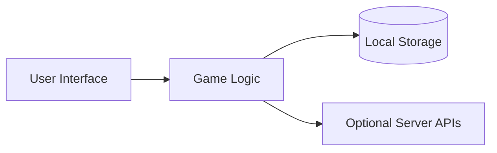

# Overview

This document outlines the architecture of the game library.

The client-side interface communicates with modular game logic. State is saved locally, while optional APIs provide multiplayer and leaderboards.

## Updating Game Data

Game metadata displayed on the landing page lives in the repository root `games.json` file.
The deployed site now consumes `/games.json` directly (with a compatibility fallback to `/public/games.json` for older builds).
Pages can boot straight from that raw catalog data — the runtime normalizes entries so games with only an `id` still expose their tags for quests.
Treat `games.json` as the source of truth and re-run the sync script when entries change.

### Why the registry matters

`games.json` acts as a single registry that powers both build-time tooling and runtime experiences:

- **Runtime rendering.** The shell fetches the registry on demand through [`shared/game-catalog.js`](../shared/game-catalog.js), normalizes each record, and exposes helpers such as `getGameById` so every surface (home grid, category filters, detail pages) can render from the same hydrated data set.
- **Offline and health tooling.** Running `npm run sync:games` executes [`tools/sync-game-catalog.mjs`](../tools/sync-game-catalog.mjs), which validates the registry and emits `data/games-offline.js` so workers and tests can fall back to a baked copy if the network is unavailable.
- **SEO and discovery.** The sitemap generator (`npm run sitemap`) loads the same registry to enumerate canonical play URLs and produce `sitemap.xml`, keeping search engines in sync with the catalog without bespoke curation.

Because these tasks read the same source, any new game automatically flows to listings, offline caches, SEO artifacts, and other automation as soon as the registry is updated.

To add a new entry:

1. Open `games.json`.
2. Copy an existing object and update its fields:
   - `id` – unique slug for the game
   - `title` – display name
   - `short` – brief description
   - `tags` – array of categories
   - `difficulty` – `easy`, `medium`, or `hard`
   - `released` – release date in `YYYY-MM-DD`
   - `playUrl` – path to the game's root
3. Ensure the JSON remains valid and each object is comma-separated.
4. Run `npm run sync:games` to refresh auxiliary artifacts (offline cache, etc.).
5. Run `npm run health` to verify the metadata.

## Quests and XP

The quest system lives in [`shared/quests.js`](../shared/quests.js) and exposes three key helpers:

- `getActiveQuests(date?)` returns the currently active daily and weekly quests along with the player's saved progress.
- `recordPlay(slug, tags, date?)` advances quest counters and adds XP when a quest goal is achieved. It is invoked automatically by [`shared/game-boot.js`](../shared/game-boot.js) whenever a game session starts.
- `getXP()` reads the accumulated XP total from local storage.

Quests are deterministic rotations seeded by UTC timestamps:

- Two daily quests are selected every calendar day (00:00 UTC) from the daily pool.
- One weekly quest is selected for each ISO week, refreshing every Monday (00:00 UTC).

Progress is tracked per profile in `localStorage` under `questProgress:<profile>:<type>:<seed>` keys. Completing a quest grants the XP defined in the quest descriptor. After each update, the module emits a `quests:updated` `CustomEvent` on `window`, allowing widgets (such as the shell quest tracker) to refresh without polling. Listeners receive `{ xp, daily, weekly, timestamp }` data in the event detail, but can also call `getActiveQuests()` and `getXP()` for the latest state.

The quest widget added to the shell (`shared/quest-widget.js`) listens for this event, renders current progress on page load, and updates automatically after each `recordPlay` call.

