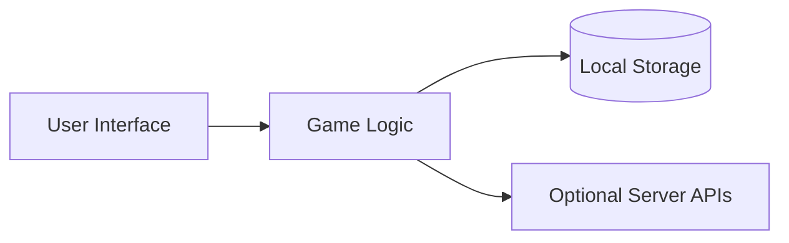

# Overview

This document outlines the architecture of the game library.

The client-side interface communicates with modular game logic. State is saved locally, while optional APIs provide multiplayer and leaderboards.

## Updating Game Data

Game metadata displayed on the landing page lives in the repository root `games.json` file.
The deployed site now consumes `/games.json` directly (with a compatibility fallback to `/public/games.json` for older builds). Treat `games.json` as the source of truth and re-run the sync script when entries change.

To add a new entry:

1. Open `games.json`.
2. Copy an existing object and update its fields:
   - `id` – unique slug for the game
   - `title` – display name
   - `short` – brief description
   - `tags` – array of categories
   - `difficulty` – `easy`, `medium`, or `hard`
   - `released` – release date in `YYYY-MM-DD`
   - `playUrl` – path to the game's root
3. Ensure the JSON remains valid and each object is comma-separated.
4. Run `npm run sync:games` to refresh auxiliary artifacts (offline cache, etc.).
5. Run `npm run health` to verify the metadata.

