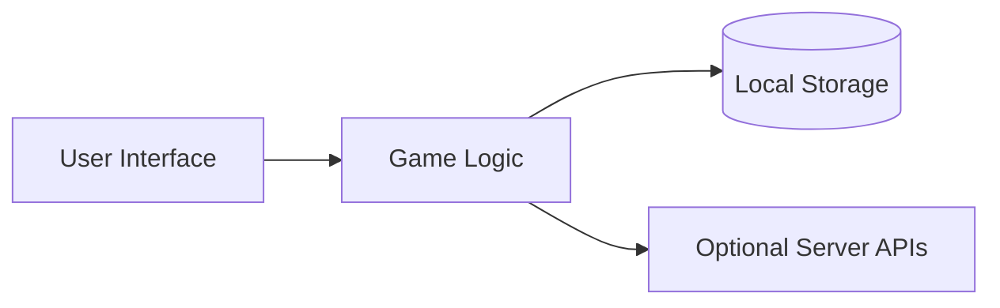

# Overview

This document outlines the architecture of the game library.

The client-side interface communicates with modular game logic. State is saved locally, while optional APIs provide multiplayer and leaderboards.

